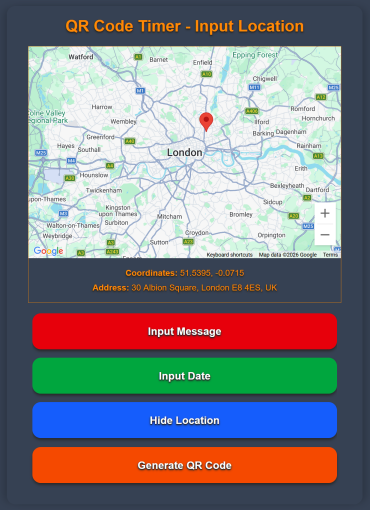
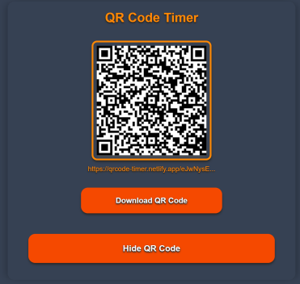
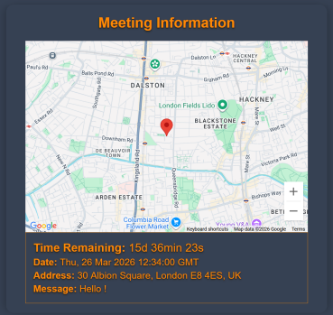

# QR Code Timer

QR Code Timer is a frontend-only React application for sharing meeting or event details through a QR code. A user can add an optional message, due date, and map location, generate a QR code for that payload, and open a route that decodes the data into a readable event page with a live countdown and location display.

Live Demo: https://qrcode-timer.netlify.app/
Repository: https://github.com/FujikoTide/qrcode-timer

## Table of Contents

- [Overview](#overview)
- [Features](#features)
- [Tech Stack](#tech-stack)
- [Architecture](#architecture)
- [Database Design](#database-design)
- [API Endpoints](#api-endpoints)
- [Installation](#installation)
- [Environment Variables](#environment-variables)
- [Usage](#usage)
- [Screenshots](#screenshots)
- [Deployment](#deployment)
- [Future Improvements](#future-improvements)
- [Credits](#credits)
- [License](#license)

## Overview

This project is designed around a simple idea: package lightweight meeting information into a compact, URL-safe string, turn that into a QR code, and let someone else open the link to view the details.

The app currently has two main screens:

- A generator page at `/` where the user enters data and creates a QR code.
- A display page at `/:id` where the encoded payload is decoded and rendered.

This is not a full-stack application. There is no backend, no database, and no user authentication. All data is encoded into the generated link itself.

## Features

- Add an optional text message.
- Add an optional date for the event.
- Select a location by clicking on a Google Map.
- Reverse-geocode the selected coordinates into a readable address.
- Compress and encode the payload into a URL-safe route segment.
- Generate a QR code that points to the encoded route.
- Share the generated link directly without requiring a QR scan.
- Download the generated QR code as a PNG image.
- Decode the payload on the destination page.
- Show a live countdown for the selected date.
- Render the saved location on a read-only Google Map.
- Display the decoded message, date, address, and countdown when available.

The payload currently uses short keys to keep the generated URL compact:

- `m`: message
- `d`: date
- `l`: location as `lat,lng`

## Tech Stack

### Frontend

- React 19
- TypeScript
- Vite
- React Router

### Styling and UI

- Tailwind CSS v4
- Custom atomic/molecular component structure

### Maps and QR

- `@vis.gl/react-google-maps`
- `qrcode.react`

### Utilities

- `pako` for compression
- `date-fns` for countdown calculations
- ESLint and Prettier for code quality and formatting

## Architecture

This project uses a frontend-only architecture.

Flow:

- The `/` route acts as the generator interface.
- User input is stored in client-side React state.
- The app serializes and compresses that data into a URL-safe route segment.
- The `/:id` route decodes the payload and renders the shared event information.
- Google Maps is used both for choosing a location and displaying it on the destination page.

There is no server, database, or external API owned by this project. The only third-party service dependency is Google Maps.

Project structure:

```txt
src/
├── components/
│   ├── atoms/
│   ├── molecules/
│   ├── organisms/
│   └── primitives/
├── hooks/
├── pages/
├── styles/
├── base64.ts
├── compression.ts
├── main.tsx
└── Root.tsx
```

Key areas:

- `src/pages/App.tsx`: collects user input and generates the QR code route.
- `src/pages/ShowData.tsx`: decodes the route payload and displays the event data.
- `src/compression.ts`: handles compression and URL-safe encoding/decoding.
- `src/components/atoms/GoogleMaps.tsx`: lets the user pick a location from the map.
- `src/components/molecules/QRDisplay.tsx`: renders the QR code and download action.

## Database Design

This project does not use a database.

All shared data is encoded directly into the generated link as a compressed payload. That means there are no persisted tables, collections, or server-side records.

## API Endpoints

This project does not expose a backend API.

Instead of calling REST endpoints, the application:

- collects data in the browser
- compresses and encodes it into the URL
- reads it back from the dynamic route on the display page

## Installation

### Prerequisites

- Node.js 18 or newer
- npm
- A Google Maps API key
- A Google Maps Map ID

### Install Dependencies

```bash
npm install
```

### Start the Development Server

```bash
npm run dev
```

The app will then be available through the local Vite development server.

```bash
npm run build
```

Creates a production build.

```bash
npm run preview
```

Serves the production build locally for preview.

```bash
npm run lint
```

Runs ESLint across the project.

## Environment Variables

Create a `.env` file in the project root and define the following variables:

```env
VITE_GOOGLE_MAPS_API_KEY=your_google_maps_api_key
VITE_GOOGLE_MAPS_MAP_ID=your_google_maps_map_id
```

Notes:

- The app uses `VITE_GOOGLE_MAPS_API_KEY` in `src/main.tsx` to initialize the Google Maps provider.
- The app uses `VITE_GOOGLE_MAPS_MAP_ID` for both the editable and read-only maps.
- Do not commit sensitive API credentials.

## Usage

1. Open the app on the home page.
2. Choose any combination of message, date, and location.
3. Click on the map to set coordinates when adding a location.
4. Generate the QR code.
5. Scan the QR code or send the generated link directly to someone.
6. View the decoded meeting information on the detail page.
7. Download the QR code if you want to share it as an image.

---

## Screenshots

[](screenshots/qrcode1.png)
[](screenshots/qrcode2.png)
[](screenshots/qrcode3.png)

---

## Deployment

This project is configured as a single-page application. The existing `netlify.toml` includes a redirect so dynamic routes like `/:id` resolve back to `index.html`.

Live deployment:

- https://qrcode-timer.netlify.app/

If you deploy to Netlify, make sure the following are configured in the deployment environment:

- `VITE_GOOGLE_MAPS_API_KEY`
- `VITE_GOOGLE_MAPS_MAP_ID`

## Future Improvements

Based on the current code and TODO notes, likely next steps include:

- Only show the generate action when at least one piece of information has been added.
- Add edit and delete flows for each input section.
- Improve the input workflow so each section feels more guided.
- Add stronger validation for empty, malformed, or incomplete payloads.
- Support richer location selection, such as search or place autocomplete.
- Add screenshots or a hosted demo link once deployment is finalized.

---

## Credits

Developer: FujikoTide  
GitHub: https://github.com/FujikoTide

---

## License

This project is licensed under the MIT License.
